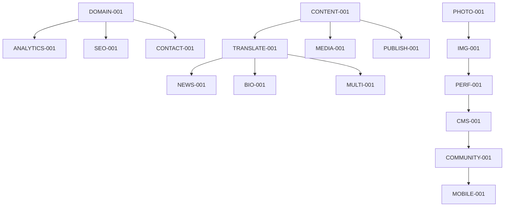

# 🗺️ Comprehensive Project Roadmap
## Dr. Jalali Professional Website

Generated using **Claude Task Master** - AI-powered task management system.

---

## 📊 Project Overview

**Total Tasks**: 17 tasks across 4 phases  
**Estimated Timeline**: 16 weeks (4 months)  
**Total Effort**: 276 hours  

### Task Breakdown by Priority:
- **Critical**: 2 tasks (PHOTO-001, DOMAIN-001)
- **High**: 4 tasks (CONTENT-001, TRANSLATE-001, IMG-001, ANALYTICS-001)  
- **Medium**: 8 tasks (Publications, SEO, Media, News, Bio, Performance, Contact)
- **Low**: 3 tasks (Multi-language, CMS, Community, Mobile)

---

## 🎯 Phase-by-Phase Roadmap

### **Phase 1: Foundation & Critical Setup** 
*Week 1-2 (Jan 18-31, 2025)*

**Goal**: Launch-ready website with essential features

| Task ID | Task | Priority | Hours | Due Date |
|---------|------|----------|-------|----------|
| **PHOTO-001** | Professional Photography Session | Critical | 8h | Jan 25 |
| **DOMAIN-001** | Configure Custom Domain | Critical | 4h | Jan 22 |
| **CONTENT-001** | Content Audit of drjalali.ir | High | 12h | Jan 29 |
| **IMG-001** | Image Optimization Pipeline | High | 6h | Jan 28 |
| **ANALYTICS-001** | Analytics & Monitoring Setup | High | 4h | Jan 30 |

**🎯 Milestone**: Basic website live on drjalali.com (Feb 1)

---

### **Phase 2: Content Enhancement**
*Week 3-4 (Feb 1-14, 2025)*

**Goal**: Rich content and professional presentation

| Task ID | Task | Priority | Hours | Due Date |
|---------|------|----------|-------|----------|
| **TRANSLATE-001** | Biography Translation | High | 16h | Feb 5 |
| **MEDIA-001** | Media Integration | Medium | 12h | Feb 10 |
| **NEWS-001** | News & Updates Section | Medium | 10h | Feb 12 |
| **BIO-001** | Enhanced Biography Section | Medium | 8h | Feb 8 |

**🎯 Milestone**: Full content release (Feb 15)

---

### **Phase 3: Technical Features**
*Week 5-6 (Feb 15-28, 2025)*

**Goal**: Performance optimization and advanced functionality

| Task ID | Task | Priority | Hours | Due Date |
|---------|------|----------|-------|----------|
| **PUBLISH-001** | Publications Database | Medium | 20h | Feb 12 |
| **SEO-001** | SEO Optimization | Medium | 8h | Feb 8 |
| **PERF-001** | Performance Optimization | Medium | 12h | Feb 20 |
| **CONTACT-001** | Contact Form & Communication | Medium | 8h | Feb 25 |

**🎯 Milestone**: Performance optimized website (Mar 1)

---

### **Phase 4: Advanced Features**
*Week 7+ (Mar 1+, 2025)*

**Goal**: Long-term enhancements and community features

| Task ID | Task | Priority | Hours | Due Date |
|---------|------|----------|-------|----------|
| **MULTI-001** | Multi-language Support | Low | 20h | Mar 10 |
| **CMS-001** | Content Management System | Low | 24h | Mar 20 |
| **COMMUNITY-001** | Community Features | Low | 30h | Apr 1 |
| **MOBILE-001** | Mobile App Companion | Low | 80h | May 1 |

**🎯 Milestone**: Community platform (Apr 1)

---

## 🔗 Task Dependencies



## 🚀 Next Actions (Available to Start Now)

Based on Claude Task Master analysis, these tasks have **no dependencies** and can start immediately:

1. **PHOTO-001** - Professional Photography Session (Critical)
2. **DOMAIN-001** - Configure Custom Domain (Critical)  
3. **CONTENT-001** - Content Audit of drjalali.ir (High)

## 📋 Task Master Commands

Use these commands to manage the roadmap:

```bash
# View all tasks
npx task-master list

# See next available task
npx task-master next

# Start working on a task
npx task-master set-status --id=PHOTO-001 --status=in-progress

# Complete a task
npx task-master set-status --id=PHOTO-001 --status=done

# View task details
npx task-master show PHOTO-001

# Expand task into subtasks
npx task-master expand --id=PHOTO-001

# Add new task
npx task-master add-task --prompt="New feature request"
```

## ⚠️ Risk Mitigation

| Risk | Impact | Probability | Mitigation |
|------|--------|-------------|------------|
| Content Translation Delays | Medium | Medium | Use professional services, start with existing content |
| Photo Session Availability | High | Low | Use placeholder initially, schedule ASAP |
| Domain Configuration Issues | High | Low | Plan for DNS propagation, backup hosting |
| Performance Issues | Medium | Medium | Implement optimization early, monitor regularly |

## 🎯 Success Metrics

- **Technical**: Lighthouse score > 90, Page load < 3s
- **Content**: All key biographical and research content translated
- **Traffic**: 1,000+ monthly visitors within 3 months
- **SEO**: Ranking for "Ali Akbar Jalali" searches
- **Performance**: Core Web Vitals all green

---

*Generated with Claude Task Master - AI-powered project management*  
*Last updated: January 18, 2025*